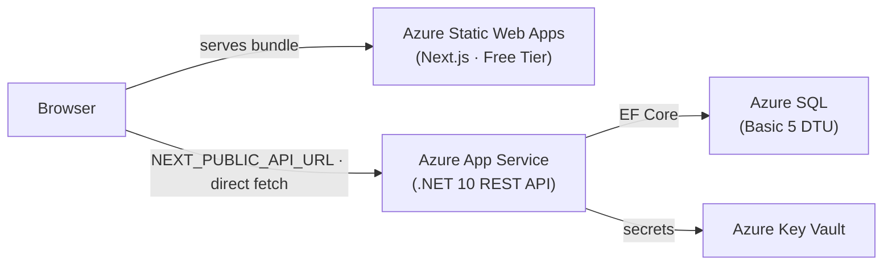
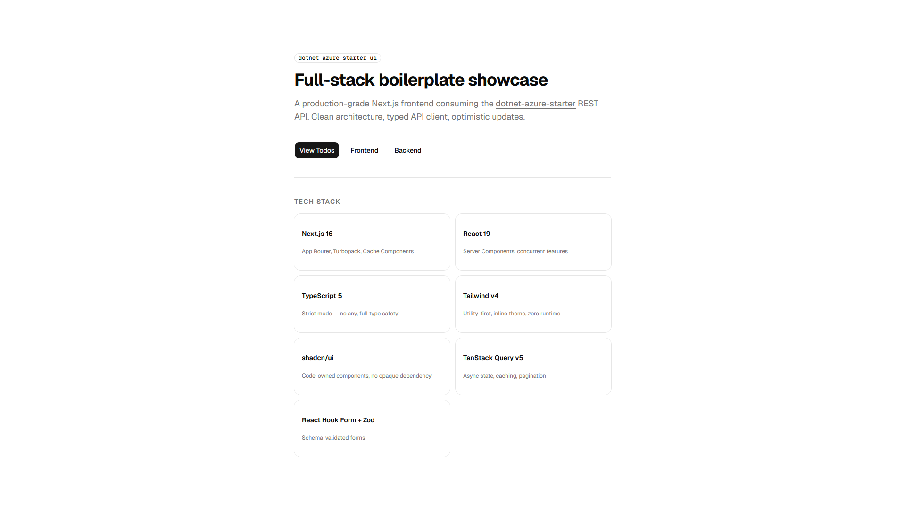
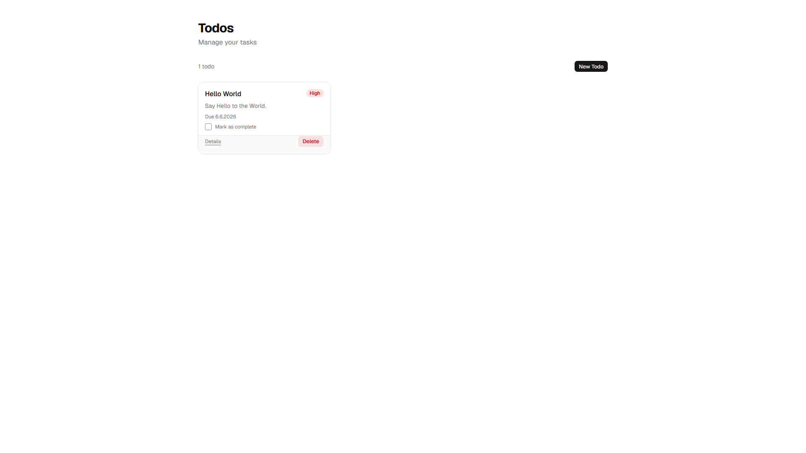
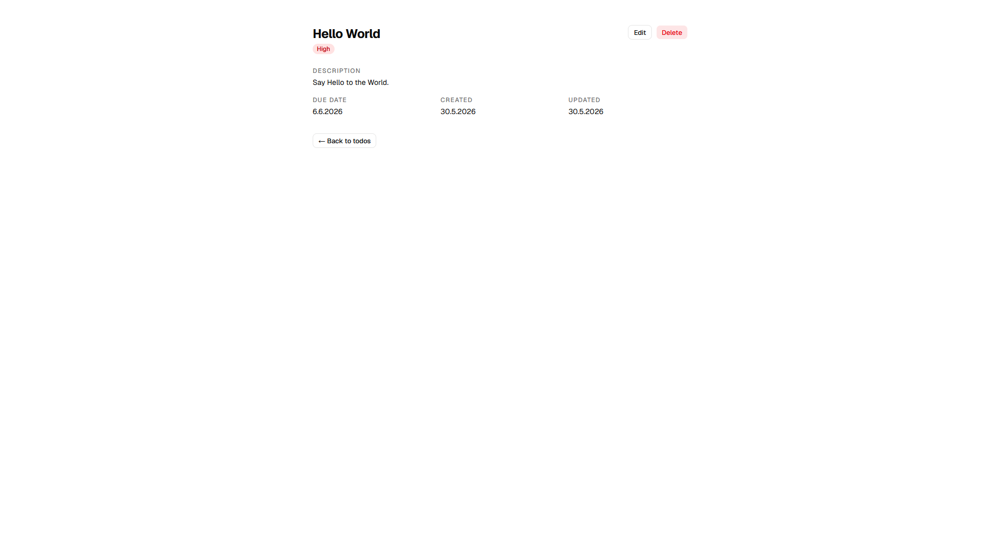
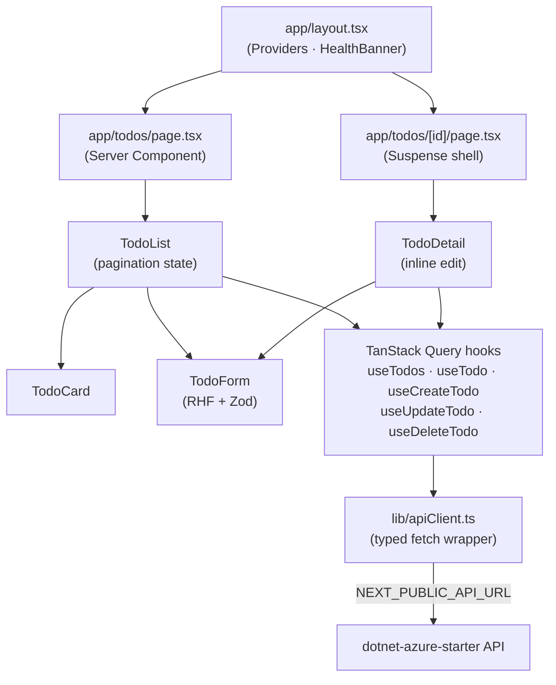
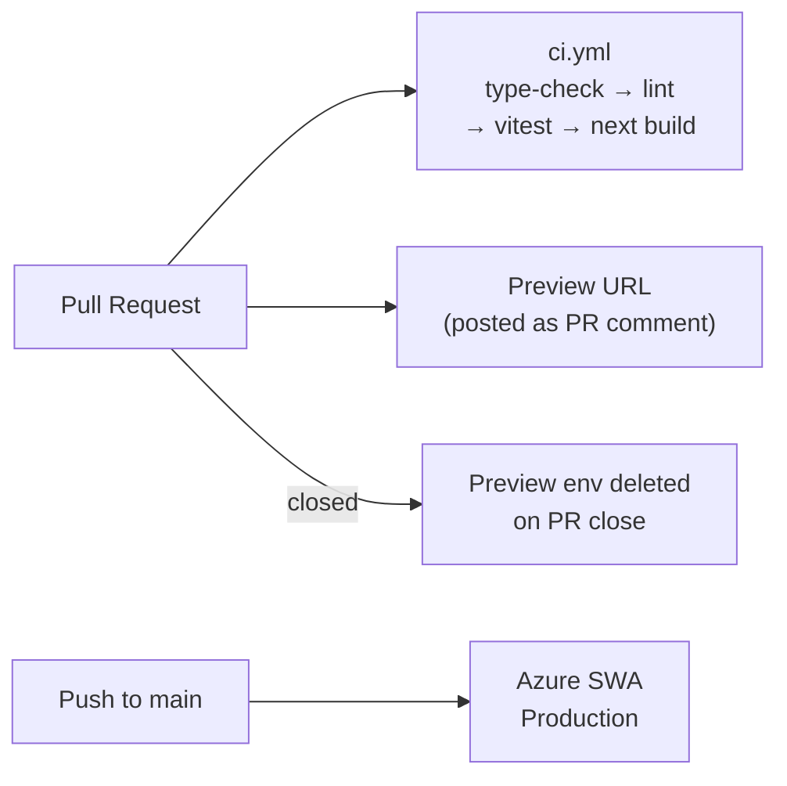

# dotnet-azure-starter-ui

Production-grade Next.js frontend for the [dotnet-azure-starter](https://github.com/ibuenuel/dotnet-azure-starter) REST API. Serves as the visual layer of the boilerplate and as a standalone portfolio piece showing full-stack engineering across independently deployable repositories.

[](https://github.com/ibuenuel/dotnet-azure-starter-ui/actions/workflows/ci.yml)
[](https://github.com/ibuenuel/dotnet-azure-starter-ui/actions/workflows/azure-static-web-apps.yml)
[](https://brave-grass-0b871c503.7.azurestaticapps.net/)


---

## Overview

This frontend consumes the `dotnet-azure-starter` .NET 10 REST API and demonstrates:

- Paginated todo list with full CRUD (create, edit, delete)
- Typed API client wrapping native `fetch` against `ApiResponse<T>` envelopes
- Optimistic updates via TanStack Query v5
- Schema-validated forms with React Hook Form + Zod
- Skeleton loaders, contextual error states with retry, and empty state UX
- API health banner — polls `GET /health` every 30 s and surfaces connectivity issues

The project deploys independently to **Azure Static Web Apps (Free Tier)** in the same subscription and resource group as the backend.

---

## Architecture



> The browser calls the .NET API directly via `NEXT_PUBLIC_API_URL` — there is no SWA proxy in the data path.

---

## Screenshots

<table>
  <tr>
    <th>Home</th>
    <th>Todo List</th>
    <th>Todo Detail</th>
  </tr>
  <tr>
    <td></td>
    <td></td>
    <td></td>
  </tr>
</table>

---

## Tech Stack

| Concern      | Technology                                  |
| ------------ | ------------------------------------------- |
| Framework    | Next.js 16 (App Router, Turbopack)          |
| Language     | TypeScript 5 (strict mode)                  |
| Styling      | Tailwind CSS v4                             |
| Components   | shadcn/ui + @base-ui/react                  |
| Server state | TanStack Query v5                           |
| HTTP client  | Native `fetch` + typed wrapper              |
| Forms        | React Hook Form + Zod                       |
| Linting      | ESLint v9 Flat Config + Prettier            |
| Testing      | Vitest + React Testing Library + Playwright |
| Deployment   | Azure Static Web Apps (Free)                |
| IaC          | Azure Bicep                                 |

---

## Project Status

| Phase | Description                                                                       | Status   |
| ----- | --------------------------------------------------------------------------------- | -------- |
| 1     | Scaffold — Next.js 16, TypeScript strict, Tailwind v4, shadcn/ui, ESLint/Prettier | Complete |
| 2     | API Client — typed `apiClient`, `ApiResponse<T>` types, `.env` setup              | Complete |
| 3     | Todo Feature — list, detail, create, edit, delete (hooks + components)            | Complete |
| 4     | Polish — loading skeletons, error states, empty states, health banner             | Complete |
| 5     | Tests — Vitest component tests, msw API mocking, Playwright E2E                   | Complete |
| 6     | IaC + CI/CD — Bicep, GitHub Actions CI + CD, Azure SWA deploy workflow            | Complete |
| 7     | Documentation — README with screenshots, architecture and CI/CD diagrams          | Complete |

---

## Prerequisites

- **Node.js 20.9+**
- **Backend running locally** — see [dotnet-azure-starter](https://github.com/ibuenuel/dotnet-azure-starter) (`docker compose up`)

For the [live demo](https://brave-grass-0b871c503.7.azurestaticapps.net/) no local setup is needed — the backend is already deployed.

---

## Local Development

```bash
# 1. Clone this repo
git clone https://github.com/ibuenuel/dotnet-azure-starter-ui
cd dotnet-azure-starter-ui

# 2. Start the backend (requires dotnet-azure-starter cloned separately)
# cd ../dotnet-azure-starter && docker compose up --build -d

# 3. Install dependencies
npm install

# 4. Configure environment
cp .env.example .env.local
# Edit .env.local — set NEXT_PUBLIC_API_URL=http://localhost:8080

# 5. Start dev server
npm run dev
# → http://localhost:3000
```

---

## Available Scripts

| Command              | Description                             |
| -------------------- | --------------------------------------- |
| `npm run dev`        | Start dev server (Turbopack)            |
| `npm run build`      | Production build                        |
| `npm run start`      | Serve production build                  |
| `npm run type-check` | TypeScript type-check (no emit)         |
| `npm run lint`       | ESLint + Prettier check                 |
| `npm run format`     | Prettier write (auto-fix formatting)    |
| `npm test`           | Vitest unit/component tests             |
| `npm run e2e`        | Playwright E2E tests (requires backend) |

---

## Project Structure

```
dotnet-azure-starter-ui/
├── app/
│   ├── layout.tsx          # Root layout — Geist fonts, metadata, HealthBanner, Providers
│   ├── page.tsx            # Landing page — tech stack showcase
│   ├── providers.tsx       # QueryClientProvider (Client Component)
│   ├── globals.css         # Tailwind v4 base + CSS theme variables
│   └── todos/
│       ├── page.tsx        # Paginated todo list (Server Component)
│       └── [id]/
│           └── page.tsx    # Todo detail — Suspense + async shell (cacheComponents compat)
│
├── components/
│   ├── ui/                 # shadcn/ui base components (badge, button, card, input, label, separator)
│   ├── todos/
│   │   ├── TodoList.tsx        # Paginated grid + Base UI Dialog for create
│   │   ├── TodoCard.tsx        # Todo card — priority badge, overdue date, completion toggle
│   │   ├── TodoForm.tsx        # Create/edit form — React Hook Form + Zod v4
│   │   ├── TodoDeleteButton.tsx # Delete button — loading + inline error state
│   │   └── TodoDetail.tsx      # Detail view with inline edit toggle
│   └── shared/
│       ├── LoadingSpinner.tsx     # Animated spinner
│       ├── Pagination.tsx         # Previous/Next pagination controls
│       ├── TodoCardSkeleton.tsx   # Skeleton placeholder matching TodoCard layout
│       ├── TodoDetailSkeleton.tsx # Skeleton placeholder matching TodoDetail layout
│       ├── ErrorState.tsx         # Error message with optional retry button
│       └── HealthBanner.tsx       # API health banner — shown only when backend unreachable
│
├── hooks/
│   ├── useTodos.ts         # GET /api/todos (paginated)
│   ├── useTodo.ts          # GET /api/todos/:id
│   ├── useCreateTodo.ts    # POST /api/todos
│   ├── useUpdateTodo.ts    # PUT /api/todos/:id
│   ├── useDeleteTodo.ts    # DELETE /api/todos/:id
│   └── useHealth.ts        # GET /health — polls every 30 s
│
├── lib/
│   ├── apiClient.ts        # Typed fetch wrapper — all HTTP calls go through here
│   ├── queryClient.ts      # makeQueryClient() factory
│   └── utils.ts            # cn() helper (clsx + tailwind-merge)
│
├── types/
│   ├── api.ts              # ApiResponse<T>, PagedResult<T>, PaginationRequest
│   └── todo.ts             # TodoItem, TodoPriority, PRIORITY_LABEL/CLASS, CreateTodoRequest, UpdateTodoRequest
│
├── __mocks__/
│   └── next/
│       ├── link.tsx        # Manual mock — renders plain <a> in tests
│       └── navigation.ts   # Manual mock — vi.fn() stubs for useRouter, usePathname
│
├── __tests__/
│   ├── setup.ts            # MSW server lifecycle + jest-dom + env vars
│   ├── mocks/
│   │   ├── factories.ts    # Type-safe test data builders (makeTodo, makeApiResponse, …)
│   │   ├── handlers.ts     # Default MSW happy-path handlers for all 6 endpoints
│   │   └── server.ts       # setupServer(…handlers)
│   ├── utils/
│   │   └── renderWithProviders.tsx  # QueryClient wrapper + createWrapper() for renderHook
│   ├── components/         # Component tests (ErrorState, HealthBanner, TodoCard, TodoForm, TodoList, TodoDeleteButton)
│   └── hooks/              # Hook tests (all 6 CRUD + useHealth hooks)
│
├── e2e/
│   └── todos.spec.ts       # Playwright — view list, create, edit, delete flows
│
├── infra/
│   └── static-web-app.bicep  # Azure Static Web Apps Free Tier — prefix/environment/backendUrl params
│
├── .github/
│   └── workflows/
│       ├── ci.yml                    # CI — type-check → lint → vitest → next build
│       └── azure-static-web-apps.yml # CD — build + deploy to Azure SWA on push to main; preview on PR
│
├── .env.example            # Environment variable documentation
├── components.json         # shadcn/ui configuration
├── eslint.config.mjs       # ESLint v9 Flat Config
├── next.config.ts          # cacheComponents: true
├── playwright.config.ts    # Playwright — Chromium, webServer: npm run dev
├── postcss.config.mjs      # @tailwindcss/postcss
├── tsconfig.json           # strict: true
└── vitest.config.ts        # jsdom, globals, setupFiles, vite-tsconfig-paths
```

---

## Component Architecture

<details>
<summary>Rendering tree and data flow</summary>



</details>

---

## Environment Variables

| Variable              | Description                              | Example                 |
| --------------------- | ---------------------------------------- | ----------------------- |
| `NEXT_PUBLIC_API_URL` | Backend API base URL — no trailing slash | `http://localhost:8080` |

Copy `.env.example` to `.env.local` before running `npm run dev`. In production, this is set as an Application Setting in Azure Static Web Apps via Bicep — never committed to source control.

---

## Deployment

The project deploys to **Azure Static Web Apps (Free Tier)** in the same subscription and resource group as the backend. Infrastructure is defined in [`infra/static-web-app.bicep`](infra/static-web-app.bicep).

### How CI/CD works



| Workflow                    | Trigger                      | What it does                              |
| --------------------------- | ---------------------------- | ----------------------------------------- |
| `ci.yml`                    | Push to `main`, PR to `main` | Type-check → lint → Vitest → `next build` |
| `azure-static-web-apps.yml` | Push to `main`               | Build + deploy to production              |
| `azure-static-web-apps.yml` | PR opened / updated          | Build + deploy to preview URL             |
| `azure-static-web-apps.yml` | PR closed                    | Delete preview environment                |

### Prerequisites

- [Azure CLI](https://learn.microsoft.com/en-us/cli/azure/install-azure-cli) installed and logged in (`az login`)
- An existing Azure resource group (e.g. `rg-dotnetazstarter-dev`)
- The backend API already deployed and its URL available

### 1 — Provision the Static Web App

```bash
az deployment group create \
  --resource-group rg-dotnetazstarter-dev \
  --template-file infra/static-web-app.bicep \
  --parameters prefix=dotnetazstarter environment=dev \
               backendUrl=https://app-dotnetazstarter-dev.azurewebsites.net
```

This creates `swa-dotnetazstarter-dev` and injects `NEXT_PUBLIC_API_URL` as an Azure Application Setting — the production URL is never committed to source control.

### 2 — Add GitHub Secrets

After provisioning, get the deploy token and add two secrets to the repository:

```bash
# Get the deploy token
az staticwebapp secrets list \
  --name swa-dotnetazstarter-dev \
  --resource-group rg-dotnetazstarter-dev \
  --query "properties.apiKey" -o tsv
```

Repository → **Settings → Secrets and variables → Actions → New repository secret**

| Secret                            | Value                                               |
| --------------------------------- | --------------------------------------------------- |
| `AZURE_STATIC_WEB_APPS_API_TOKEN` | Deploy token from command above                     |
| `NEXT_PUBLIC_API_URL`             | `https://app-dotnetazstarter-dev.azurewebsites.net` |

Once both secrets are set, push to `main` — the CD workflow deploys automatically.

### 3 — Deployed URL

```bash
az staticwebapp show \
  --name swa-dotnetazstarter-dev \
  --resource-group rg-dotnetazstarter-dev \
  --query "defaultHostname" -o tsv
```

---

## Related

- **Backend:** [dotnet-azure-starter](https://github.com/ibuenuel/dotnet-azure-starter) — .NET 10 REST API on Azure App Service
- **Live Demo:** [brave-grass-0b871c503.7.azurestaticapps.net](https://brave-grass-0b871c503.7.azurestaticapps.net/)

---

_Author: Ismail Bünül — Senior Software Engineer & Deputy Head of IT_
